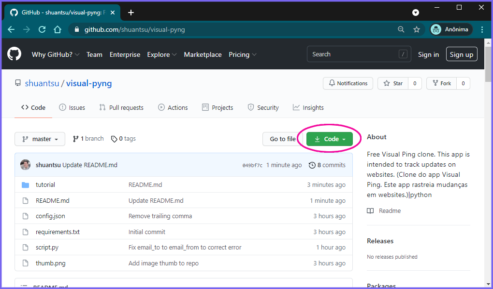

## VISUALPYNG

**O que é:** Minha versão do app [VisualPing.io](https://visualping.io/ "VisualPing.io"), sem a limitação mínima de 6 horas a cada execução. Este app é feito em python e envia para o seu e-mail as atualizações bem como print do site quando houverem atualizações.

## Como instalar

1 - Instale o python versão 3.9 no seu pc.

https://www.python.org/

------------

2 - Clone o repositório no seu pc. Clique no botão verde `Code` e depois clique para baixar o zip. Extraia o conteúdo do zip em uma nova pasta que preferir.




------------

3 - Abra o terminal e navegue até a pasta do projeto. Lá rode este comando:
`python -m pip -r requirements.txt`.

------------

4 - Crie uma conta de e-mail para o uso exclusivo do app, você pode usar sua própria conta, mas é recomendável criar uma conta exclusiva por questões de segurança.

Use estas instruções para gerar a senha de app:

https://support.google.com/accounts/answer/185833?hl=pt-BR

------------

5 - Agora você irá editar o arquivo `config.json`

Ele vem assim no repositório:

```json
{
  "frequencyMinutes": 30,
  "pauseSeconds": 15,
  "emailFrom": "email.from@gmail.com",
  "emailTo": "email.to@gmail.com",
  "password": "app-password-here",
  "screenHeight": 1000,
  "screenWidth": 1400,
  "sites": [
    ["https://my-site1.com/", "site1"],
    ["https://my-site2.com/", "site2"],
    ["https://my-site3.com/", "site3"]
  ]
}
```

**Configure as opções conforme a tabela:**

|         Chave        |                                        Valor                                       |
|----------------------|------------------------------------------------------------------------------------|
| **frequencyMinutes** | de quanto em quanto tempo, em minutos, o app irá rodar.                            |
| **pauseSeconds**     | o tempo, em segundos,  que o app irá esperar a página carregar.                    |
| **emailFrom**        | o endereço de e-email que você criou para enviar.                                  |
| **emailTo**          | o e-mail recebedor.                                                                |
| **password**         | aqui vai a senha do app do gmail.                                                  |
| **screenHeight**     | altura da tela no print.                                                           |
| **screenWidth**      | largura da tela no print.                                                          |
| **sites**            | os endereços e rótulos dos sites no formato `["endereço", "rótulo"], [...], [...]` |

------------

6 - Com tudo instalado você está pronto para rodar o app. Rode com o comando no terminal:
`python script.py`

------------

**Recomendado:**

7 - Você pode criar um atalho para a pasta de inicialização do windows para executar o app ao iniciar o seu computador. No windows, pressione `windows + r` e digite `shell:startup`. Dentro desta pasta, crie um atalho conforme a tela a seguir:

